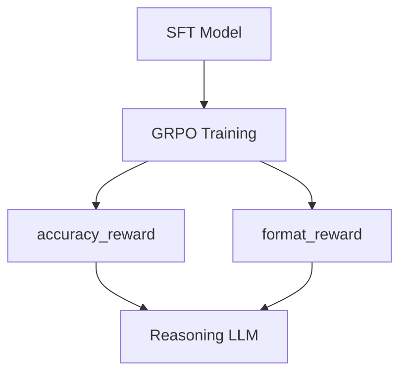

# Case Study: DeepSeek-R1 Style GRPO Training

DeepSeek-R1 chứng minh rằng GRPO + rule-based rewards có thể tạo ra reasoning model mạnh mà không cần reward model hay preference data.

---

## 1. Pipeline Overview



---

## 2. Cấu hình GRPOTrainer

```python
from trl import GRPOConfig, GRPOTrainer
from trl.rewards import accuracy_reward, format_reward

config = GRPOConfig(
    output_dir="deepseek-r1-style",
    num_generations=16,
    max_completion_length=2048,
    temperature=1.0,
    beta=0.001,
    loss_type="dapo",
    num_iterations=4,
    learning_rate=1e-6,
    gradient_accumulation_steps=8,
)

trainer = GRPOTrainer(
    model="Qwen/Qwen2.5-7B-Instruct",
    reward_funcs=[
        accuracy_reward,
        format_reward,
    ],
    args=config,
    train_dataset=math_dataset,
)
trainer.train()
```

---

## 3. Key Design Decisions

### 3.1. High num_generations (G=16)

Nhiều generations per prompt giúp advantage estimator chính xác hơn:
- Variance giảm theo $1/\sqrt{G}$
- G=16 cho phép phát hiện subtle quality differences

### 3.2. Low KL penalty (beta=0.001)

Reasoning models cần freedom để explore novel solution paths. KL penalty quá cao sẽ kìm hãm exploration.

### 3.3. DAPO loss

DAPO normalizes advantage trên toàn batch (thay vì per-sample), giúp gradient signal ổn định hơn khi completion lengths biến thiên lớn.

### 3.4. Multi-step updates (mu=4)

Tái sử dụng completions 4 lần, tăng sample efficiency. Importance sampling ratio ngăn off-policy drift.

---

## 4. Reward Design

### accuracy_reward
- Sử dụng math_verify để so sánh symbolic equivalence
- Extract answer from boxed notation
- Returns 1.0 (correct), 0.0 (wrong), or None (unparseable)

### format_reward
- Regex check for reasoning structure (think/answer tags)
- Encourages chain-of-thought reasoning
- Returns 1.0 (valid format) or 0.0 (invalid)

---

## 5. Expected Results

| Metric | Before GRPO | After GRPO |
|:---|:---|:---|
| MATH accuracy | 55-60% | 70-75% |
| GSM8K accuracy | 80-85% | 90-95% |
| Reasoning quality | Direct answers | Chain-of-thought |
