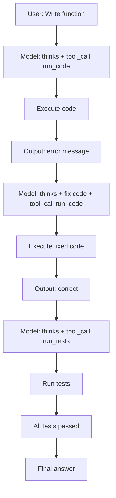

# Case Study: Tool-calling Multi-turn RL

TRL GRPOTrainer hỗ trợ huấn luyện model sử dụng tools qua nhiều lượt (multi-turn), với environment factory pattern cho parallel independent interactions.

---

## 1. Environment Factory Pattern

```python
class CodeEnvironment:
    """Environment cho code execution tool-calling."""
    
    def reset(self) -> str | None:
        self.history = []
        self.test_cases = []
        return None
    
    def run_code(self, code: str) -> str:
        """Execute Python code and return output."""
        try:
            result = execute_sandboxed(code, timeout=10)
            return result.stdout
        except Exception as e:
            return f"Error: {str(e)}"
    
    def run_tests(self, code: str) -> str:
        """Run test cases against submitted code."""
        results = []
        for test in self.test_cases:
            result = execute_sandboxed(f"{code}\n{test}")
            results.append(result.stdout)
        return "\n".join(results)

def make_env():
    return CodeEnvironment()
```

---

## 2. GRPOTrainer Configuration

```python
trainer = GRPOTrainer(
    model="Qwen/Qwen2.5-7B-Instruct",
    reward_funcs=code_reward,
    environment_factory=make_env,
    tools=[
        CodeEnvironment.run_code,
        CodeEnvironment.run_tests,
    ],
    args=GRPOConfig(
        max_completion_length=4096,
        max_tool_calling_iterations=5,  # Tối đa 5 lượt tool call
        num_generations=8,
    ),
    train_dataset=code_dataset,
)
```

---

## 3. Multi-turn Flow



Mỗi environment instance có state riêng, cho phép parallel execution.

---

## 4. Tool Masking

Trong multi-turn RL, tool response tokens không nên contribute vào policy gradient:

```python
# tool_mask: 1 cho model-generated tokens, 0 cho tool responses
if "tool_mask" not in inputs:
    mask = completion_mask
else:
    mask = completion_mask * inputs["tool_mask"]
```

Điều này ngăn model "học dự đoán" tool responses (chúng đến từ environment, không phải từ model).

---

## 5. Reward Design cho Tool-calling

```python
def code_reward(completions, solution, **kwargs):
    rewards = []
    for completion, sol in zip(completions, solution):
        content = completion[0]["content"]
        
        # Reward 1: Tests pass
        test_score = run_tests(content, sol["test_cases"])
        
        # Reward 2: Efficient tool usage (penalize too many iterations)
        tool_calls = count_tool_calls(content)
        efficiency = max(0, 1.0 - 0.1 * (tool_calls - 1))
        
        rewards.append(test_score * efficiency)
    return rewards
```
