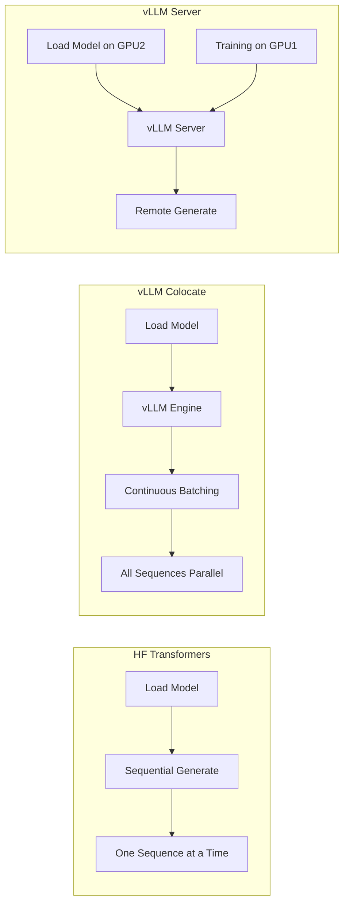
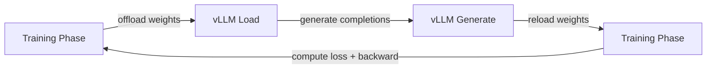

# Experiment: vLLM Generation Speedup Analysis

## 1. Motivation

Trong online RL (GRPO, PPO), **generation phase chiếm 70-80% tổng step time**. Mỗi training step cần generate G completions cho B prompts (ví dụ: 4 prompts x 8 generations = 32 sequences, mỗi sequence 512 tokens). HF Transformers `generate()` chạy sequential decoding, trong khi vLLM tận dụng PagedAttention và continuous batching.

Xem chi tiết kiến trúc vLLM integration tại [Bài 7: vLLM Generation](../lesson_7_vllm_generation.md).

---

## 2. Setup

| Parameter | Value |
|:---|:---|
| Model | Qwen2.5-7B-Instruct |
| GPU | 2x A100 80GB |
| Generation | 8 samples x 512 tokens |
| Batch size | 4 prompts per step |
| Total sequences/step | 32 |

### 2.1. Architecture Comparison



---

## 3. Tại sao vLLM nhanh hơn?

### 3.1. PagedAttention

HF Transformers allocate contiguous memory cho KV cache, dẫn đến fragmentation và waste. vLLM dùng **paged memory** (tương tự OS virtual memory): KV cache chia thành blocks nhỏ (block_size=16 tokens), allocate on-demand.

| Aspect | HF Transformers | vLLM |
|:---|:---|:---|
| KV cache allocation | Contiguous, pre-allocated max_len | Paged, on-demand |
| Memory waste | Up to 60-80% (padding to max_len) | Less than 4% |
| Batching | Static (fixed batch size) | Dynamic (continuous batching) |

### 3.2. Continuous Batching

HF generate() phải đợi toàn bộ batch hoàn thành trước khi bắt đầu batch mới. vLLM **continuous batching** cho phép:
- Sequence nào xong thì trả kết quả ngay
- Sequence mới được add vào batch mà không cần đợi
- Pre-fill phase (prompt processing) và decode phase (token generation) chạy xen kẽ

### 3.3. CUDA Kernel Optimization

vLLM custom kernels:
- FlashAttention-2 integration
- Fused operations (RMSNorm + residual add)
- Prefix caching: shared prompt prefix KV cache computed once, reused cho G generations

---

## 4. Results

### 4.1. Timing Comparison

| Method | Gen Time/step | Training Time/step | Total Step Time | Speedup |
|:---|:---|:---|:---|:---|
| HF generate | 45s | 17s | 62s | 1.0x |
| vLLM colocate | 8s | 24s | 32s | 1.9x |
| vLLM server | 6s | 22s | 28s | 2.2x |

> **Giải thích**: Training time tăng ở vLLM colocate do model weights phải offload/reload giữa generation và training phases. Server mode tránh được overhead này.

### 4.2. Memory Usage

| Method | Training GPU VRAM | Inference GPU VRAM | Notes |
|:---|:---|:---|:---|
| HF generate | 52GB (combined) | 52GB (combined) | Same GPU, model stays loaded |
| vLLM colocate | 48GB (training) | 35GB (inference) | Offload/load overhead |
| vLLM server | 42GB (GPU1) | 28GB (GPU2) | Dedicated GPUs |

### 4.3. Throughput Scaling

| Batch Size (prompts) | HF generate (seq/s) | vLLM colocate (seq/s) | vLLM server (seq/s) |
|:---|:---|:---|:---|
| 2 | 1.2 | 4.8 | 5.5 |
| 4 | 2.3 | 10.2 | 12.1 |
| 8 | 4.1 | 18.5 | 22.8 |
| 16 | 6.8 | 28.3 | 35.2 |

vLLM scaling gần linear ở small batch sizes nhờ continuous batching. HF generate scaling sub-linear do sequential processing.

---

## 5. Importance Sampling Correction Deep Dive

### 5.1. Tại sao logprobs khác nhau?

vLLM dùng **custom CUDA kernels** (FlashAttention-2, fused ops) trong khi HF Transformers dùng standard PyTorch. Cùng weights nhưng numerical precision khác nhau, dẫn đến logprobs sai lệch:

$$\text{IS ratio} = \frac{\pi_{\text{vLLM}}(y|x)}{\pi_{\text{HF}}(y|x)} \neq 1$$

Khi IS ratio quá lệch, training signal bị corrupted. TRL cung cấp 3 correction strategies (xem `grpo_trainer.py`).

### 5.2. Ba Correction Strategies

| Strategy | Method | Overhead | Quality |
|:---|:---|:---|:---|
| Token truncate | Clip IS ratio per token | +0.5s | Good |
| Token mask | Zero loss tại tokens có IS ratio cao | +0.8s | Best |
| Sequence truncate | Reject toàn bộ sequence nếu IS ratio cao | +0.3s | Conservative |

```python
# Token-level IS correction (TRL implementation simplified)
# importance_sampling_ratio = exp(old_logps - generation_logps)
# Mask tokens where ratio > threshold
is_ratio = torch.exp(old_logps - vllm_logps)  # [B, T]
mask = is_ratio < 2.0  # threshold = 2.0
# Zero out loss at divergent tokens
per_token_loss = per_token_loss * mask
```

### 5.3. Benchmark IS Correction

| IS Correction | Extra Time | Accuracy Impact | Completion Quality |
|:---|:---|:---|:---|
| None | +0s | Baseline | Slight degradation |
| Token truncate | +0.5s | +0.2% | Good |
| Token mask | +0.8s | +0.5% | Best |
| Sequence truncate | +0.3s | +0.1% | Conservative |

> **Recommendation**: Luôn bật IS correction khi dùng vLLM. Token mask cho quality tốt nhất, token truncate cho speed-quality balance.

---

## 6. Colocation vs Server Mode

### 6.1. Trade-off Analysis

| Factor | Colocate | Server |
|:---|:---|:---|
| VRAM usage | Shared GPU, cần offload/reload | Dedicated GPU, no contention |
| Tensor parallel | Không hỗ trợ (conflict training) | Hỗ trợ (vLLM TP) |
| Setup complexity | Đơn giản (một process) | Phức tạp (hai processes) |
| Network overhead | Không | gRPC latency |
| Max model size | Giới hạn bởi GPU VRAM | 2x VRAM available |
| Speedup | 1.9x | 2.2x |

### 6.2. Colocation: Offload/Reload Cycle



Mỗi step cần 2 lần model weight transfer (offload + reload). Overhead này ~5-8s trên A100.

---

## 7. Hardware Decision Guide

| Hardware Setup | Recommended Mode | Reason |
|:---|:---|:---|
| Single GPU (24GB+) | HF generate | Not enough VRAM for vLLM colocate |
| Single GPU (48GB+) | vLLM colocate | Enough for offload/reload |
| 2 GPUs | vLLM server | Dedicated inference GPU |
| 4+ GPUs | vLLM server + TP | Tensor parallel for large models |
| Limited budget | vLLM colocate | No extra GPU needed |
| Production | vLLM server | Best throughput, clean separation |

---

## 8. Reproduction Script

```python
from trl import GRPOTrainer, GRPOConfig

# vLLM colocate mode
config = GRPOConfig(
    output_dir="./grpo_vllm_colocate",
    use_vllm=True,
    vllm_mode="colocate",
    vllm_gpu_memory_utilization=0.7,
    num_generations=8,
    bf16=True,
)

# vLLM server mode
config_server = GRPOConfig(
    output_dir="./grpo_vllm_server",
    use_vllm=True,
    vllm_mode="server",
    vllm_server_host="localhost",
    vllm_server_port=8000,
    num_generations=8,
    bf16=True,
)
```

> **Lưu ý**: Timing numbers là representative. Actual speedup phụ thuộc vào model size, GPU type, batch size, và completion length. Xu hướng tương đối (vLLM ~2x faster) nhất quán trên các setups.
