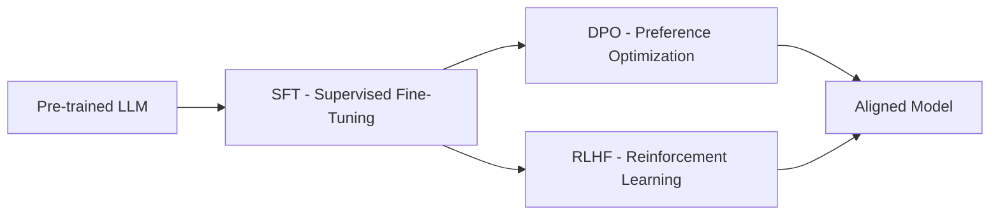
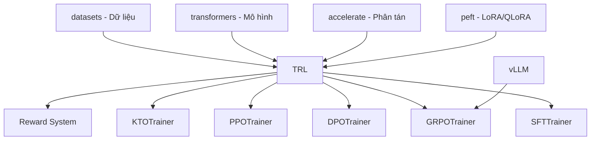

# Bài 0: Nền tảng Alignment & Toàn cảnh RLHF

Trước khi đi sâu vào mã nguồn của thư viện **TRL**, chúng ta cần xây dựng nền tảng vững chắc về lý do tại sao Alignment lại quan trọng, các phương pháp tiếp cận chính, và vị trí của TRL trong hệ sinh thái Hugging Face.

---

## 1. Tại sao LLM cần Alignment?

Các mô hình ngôn ngữ lớn (LLM) sau giai đoạn Pre-training chỉ đơn thuần tối ưu hóa objective "dự đoán token tiếp theo". Kết quả là chúng có thể:
- Tạo ra thông tin sai lệch (hallucination)
- Sinh nội dung độc hại hoặc không an toàn
- Không tuân thủ chỉ dẫn (instruction following kém)
- Ưu tiên "văn bản trôi chảy" hơn "câu trả lời đúng"

**Alignment** là quá trình điều chỉnh hành vi của mô hình sao cho phù hợp với ý định con người. Pipeline tiêu chuẩn gồm ba giai đoạn:

### 1.1. SFT (Supervised Fine-Tuning)

SFT là bước đầu tiên và đơn giản nhất: fine-tune mô hình trên các cặp (instruction, response) chất lượng cao do con người viết. Mô hình học cách bắt chước format và style của câu trả lời tốt.

**Hạn chế**: Mô hình bị giới hạn bởi chất lượng và số lượng dữ liệu mẫu. Nó không thể "vượt qua" trình độ của người viết mẫu, và không có cơ chế khám phá (exploration) các chiến lược trả lời tốt hơn.

### 1.2. DPO (Direct Preference Optimization)

DPO tối ưu hóa trực tiếp từ dữ liệu ưu tiên (preference data): mỗi sample gồm một prompt, một câu trả lời "chosen" (tốt) và một câu trả lời "rejected" (tệ).

**Ưu điểm**: Không cần huấn luyện reward model riêng biệt, không cần RL loop phức tạp. Đơn giản và ổn định.

**Hạn chế**: Có thể gặp vấn đề khi phân phối của mô hình dịch chuyển xa khỏi dữ liệu huấn luyện ban đầu (distribution shift).

### 1.3. RLHF (Reinforcement Learning from Human Feedback)

RLHF cho phép mô hình tự khám phá (explore) các câu trả lời khác nhau, nhận điểm thưởng (reward), và cập nhật trọng số theo hướng tối đa hóa reward. RLHF đặc biệt mạnh mẽ cho các tác vụ tư duy (reasoning) phức tạp như toán học và lập trình, nơi mô hình có thể tự sửa lỗi qua quá trình training.

---

## 2. Toán học nền tảng của RLHF

### 2.1. Objective function

Mục tiêu của RLHF là tìm chính sách (policy) $\pi_\theta$ tối đa hóa kỳ vọng tổng reward, đồng thời không đi quá xa khỏi chính sách tham chiếu $\pi_{ref}$:

$$\max_{\pi_\theta} \mathbb{E}_{x \sim \mathcal{D}, y \sim \pi_\theta(\cdot|x)} \left[ R(x, y) - \beta \cdot D_{KL}(\pi_\theta(\cdot|x) \| \pi_{ref}(\cdot|x)) \right]$$

Trong đó:
* $x$ là prompt, $y$ là response được sinh ra từ policy $\pi_\theta$
* $R(x, y)$ là hàm reward (từ reward model hoặc rule-based)
* $\beta$ là hệ số KL penalty, kiểm soát mức độ "lệch" cho phép so với reference
* $D_{KL}$ là KL Divergence, đo khoảng cách phân phối giữa policy và reference

### 2.2. PPO (Proximal Policy Optimization)

PPO áp dụng clipped surrogate objective để ổn định hóa quá trình cập nhật:

$$L^{CLIP}(\theta) = \hat{\mathbb{E}}_t \left[ \min\left(r_t(\theta)\hat{A}_t, \text{clip}(r_t(\theta), 1-\epsilon, 1+\epsilon)\hat{A}_t\right) \right]$$

Với:
* $r_t(\theta) = \frac{\pi_\theta(a_t | s_t)}{\pi_{\theta_{old}}(a_t | s_t)}$ là probability ratio
* $\hat{A}_t$ là advantage ước lượng bởi GAE (Generalized Advantage Estimation)

PPO yêu cầu 4 mô hình đồng thời: Actor, Reference, Critic (value network), và Reward model.

### 2.3. GRPO (Group Relative Policy Optimization)

GRPO loại bỏ hoàn toàn Critic model bằng cách so sánh tương đối giữa nhóm các câu trả lời:

$$A_i = \frac{r_i - \text{mean}(\{r_1, ..., r_G\})}{\text{std}(\{r_1, ..., r_G\})}$$

Với $G$ câu trả lời được sinh cho cùng một prompt. Hàm mục tiêu:

$$J_{GRPO}(\theta) = \frac{1}{G} \sum_{i=1}^G \sum_{t=1}^{T} \left[ \min\left(\rho_{i,t} A_i, \text{clip}(\rho_{i,t}, 1-\epsilon, 1+\epsilon) A_i\right) - \beta D_{KL}(\pi_\theta \| \pi_{ref}) \right]$$

Với $\rho_{i,t} = \frac{\pi_\theta(o_{i,t} | q, o_{i,<t})}{\pi_{\theta_{old}}(o_{i,t} | q, o_{i,<t})}$.

---

## 3. Hệ sinh thái Hugging Face & Vị trí của TRL

### 3.1. Các thư viện nền tảng

* **Transformers**: Cung cấp `PreTrainedModel`, `Trainer`, `TrainingArguments`, tokenizer, và generation pipeline. TRL kế thừa trực tiếp từ lớp `Trainer`.
* **Accelerate**: Xử lý phân tán (DDP, FSDP, DeepSpeed), mixed precision, gradient accumulation. TRL dùng `Accelerator` và `PartialState` để quản lý multi-GPU.
* **PEFT**: Parameter-Efficient Fine-Tuning (LoRA, QLoRA). TRL tận dụng PEFT để tránh tải reference model riêng (khi dùng LoRA, adapter tắt = reference).
* **Datasets**: Quản lý dataset dạng Arrow-based, streaming, map/filter operations.
* **vLLM**: Inference engine tốc độ cao, được TRL tích hợp cho generation phase của GRPO/PPO.

### 3.2. Vai trò của TRL

TRL nằm ở tầng cao nhất, đóng vai trò **orchestrator** cho toàn bộ quá trình alignment:

1. **SFT**: Fine-tune mô hình trên dữ liệu instruction-response
2. **Preference Learning**: DPO, CPO, KTO, ORPO...
3. **RL-based Alignment**: GRPO (stable), PPO (experimental)
4. **Reward System**: Reward functions, reward models, accuracy verification
5. **Generation**: Tích hợp vLLM cho generation tốc độ cao

---

## 4. Tổng quan về TRL Trainers

| Trainer | Loại | Mô hình cần | Trạng thái |
|:---|:---|:---|:---|
| `SFTTrainer` | Supervised | 1 (policy) | Stable |
| `DPOTrainer` | Preference | 2 (policy + ref) | Stable |
| `GRPOTrainer` | RL | 2-3 (policy + ref + reward) | Stable |
| `KTOTrainer` | Preference (unpaired) | 2 (policy + ref) | Stable |
| `RewardTrainer` | Reward training | 1 (reward model) | Stable |
| `RLOOTrainer` | RL | 2-3 | Stable |
| `PPOTrainer` | RL | 4 (actor + ref + critic + reward) | Experimental |
| `CPOTrainer` | Preference | 1 (không cần ref) | Experimental |
| `ORPOTrainer` | Preference | 1 (không cần ref) | Experimental |

Trong các bài tiếp theo, chúng ta sẽ đi sâu vào mã nguồn của từng trainer, bắt đầu từ kiến trúc tổng thể của TRL.
