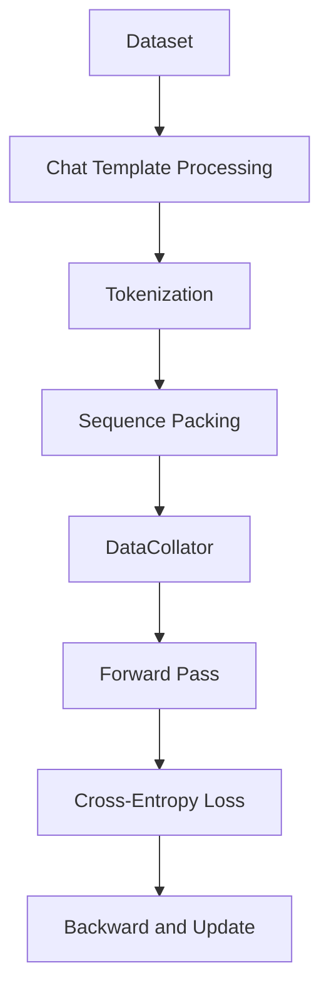

# Bài 2: SFT Trainer - Supervised Fine-Tuning Deep Dive

SFT (Supervised Fine-Tuning) là bước đầu tiên trong pipeline alignment. `SFTTrainer` trong TRL cung cấp các cơ chế xử lý dữ liệu đặc biệt cho chat-based LLM, sequence packing, và multimodal support.

---

## 1. Luồng dữ liệu trong SFTTrainer



### 1.1. Dataset formats

SFTTrainer hỗ trợ hai format dữ liệu:

**Standard format**: Text trực tiếp với cột `text`.

**Conversational format**: Structured messages với cột `messages` chứa các dict có `role` và `content`.

### 1.2. Chat template processing

Khi nhận conversational data, SFTTrainer sử dụng `apply_chat_template` để chuyển đổi messages thành token sequence. Chat template phải được áp dụng trước khi tokenize, vì template chứa các special tokens (như BOS, EOS markers) mà tokenizer cần xử lý đúng cách.

Hàm `is_conversational()` trong `data_utils.py` tự động phát hiện format dữ liệu bằng cách kiểm tra:

```python
# data_utils.py: is_conversational()
supported_keys = ["prompt", "chosen", "rejected", "completion", "messages"]
example_keys = {key for key in example.keys() if key in supported_keys}
key = example_keys.pop()
maybe_messages = example[key]
# Phải là list của dicts có "role" và "content"
if isinstance(maybe_messages[0], dict) and "role" in maybe_messages[0]:
    return True
```

### 1.3. apply_chat_template: Chi tiết hoạt động

`apply_chat_template()` (`data_utils.py`) hỗ trợ nhiều kiểu examples:

| Keys trong example | Use case | Chat template áp dụng |
|:---|:---|:---|
| `messages` | Language modeling | Template toàn bộ conversation |
| `prompt` | Prompt-only | Template prompt + generation prompt |
| `prompt` + `completion` | SFT | Template riêng prompt/completion |
| `prompt` + `chosen` + `rejected` | Preference | Template từng response |

Điều quan trọng: khi xử lý `prompt`, hàm kiểm tra `last_role`:
- `user` hoặc `tool`: thêm `add_generation_prompt=True` (để model bắt đầu sinh response)
- `assistant`: dùng `continue_final_message=True` (để continuation prompt)

---

## 2. Sequence Packing

### 2.1. Vấn đề của padding

Trong SFT truyền thống, mỗi batch được pad đến chiều dài của sequence dài nhất. Với dữ liệu chat có chiều dài biến thiên lớn (từ vài chục đến vài nghìn tokens), padding gây lãng phí compute đáng kể.

### 2.2. Kỹ thuật packing

TRL cung cấp `pack_dataset()` (`data_utils.py`) với **3 strategies** khác nhau:

| Strategy | Mô tả | Use case |
|:---|:---|:---|
| `bfd` (Best Fit Decreasing) | Giữ nguyên sequence boundaries, truncate overflow | SFT, conversational |
| `bfd_split` | Chia nhỏ overflow sequences để pack tiếp | Pre-training, long docs |
| `wrapped` | Bỏ qua boundaries, cắt giữa chừng để fill | Fastest, aggressive |

```python
# data_utils.py: pack_dataset()
# Ví dụ bfd strategy
packed_dataset = pack_dataset(dataset, seq_length=2048, strategy="bfd")
# Output: mỗi sample có độ dài gần 2048 tokens
# Kèm theo seq_lengths column để biết boundaries
```

**Ưu điểm**: Giảm padding waste từ 30-60% xuống gần 0%. Mỗi GPU step xử lý được nhiều thông tin hơn.

**Thách thức**: Loss computation cần cẩn thận để không tính cross-attention giữa các samples khác nhau. `bfd` và `bfd_split` sinh ra `seq_lengths` column, giúp xây dựng attention mask chặn attention giữa các samples:

```python
# Attention mask cho packed sequences
# seq_lengths = [[100, 80, 50], [120, 90]]  (2 packed sequences)
# Sequence 1: tokens [0:100] attend nhau, [100:180] attend nhau, [180:230] attend nhau
# KHÔNG có attention giữa [0:100] và [100:180]
```

---

## 3. Completion-only Loss

Một khía cạnh quan trọng của SFT: loss chỉ nên tính trên phần **response** (completion), không tính trên phần **prompt**.

### 3.1. Label masking

Trong quá trình tokenize, các token thuộc về prompt được gán label = -100 (ignore_index trong CrossEntropyLoss):

```python
# Pseudocode
labels = input_ids.clone()
# Mask prompt tokens
labels[:prompt_length] = -100
# Chỉ response tokens mới contribute vào loss
loss = F.cross_entropy(logits.view(-1, vocab_size), labels.view(-1))
```

### 3.2. Tại sao masking prompt tokens?

Nếu tính loss trên cả prompt, mô hình sẽ "học lại" cách dự đoán prompt tokens, điều này:
1. Lãng phí gradient signal vào phần input đã biết trước
2. Có thể gây overfitting vào format của prompt
3. Không phản ánh đúng mục tiêu: mô hình cần học sinh response tốt, không cần "học thuộc" prompt

### 3.3. DataCollatorForCompletionOnlyLM

TRL cung cấp `DataCollatorForCompletionOnlyLM` để tự động xác định prompt boundary dựa trên `response_template`:

```python
from trl import SFTTrainer, SFTConfig

# Response template là string đánh dấu bắt đầu response
response_template = "### Response:"
collator = DataCollatorForCompletionOnlyLM(
    response_template=response_template,
    tokenizer=tokenizer,
)

trainer = SFTTrainer(
    model="meta-llama/Llama-3-8B",
    args=SFTConfig(max_length=2048),
    data_collator=collator,
    train_dataset=dataset,
)
```

DataCollator tokenize từng sample, tìm `response_template` trong tokenized output, và gán `labels = -100` cho tất cả tokens trước template. Cách tiếp cận này robust hơn manual `prompt_length` vì nó dựa trên exact string match.

---

## 4. Multimodal Support

SFTTrainer hỗ trợ Vision-Language Models (VLMs) thông qua `prepare_multimodal_messages`:

```python
def prepare_multimodal_messages(messages, processor):
    """Xử lý messages chứa image/video content."""
    # Extract image/video từ messages
    # Process bằng processor (AutoProcessor)
    # Trả về pixel_values, image_grid_thw, etc.
```

Khi training VLM, forward pass nhận thêm các inputs:
* `pixel_values`: Tensor chứa image features
* `image_grid_thw`: Grid dimensions cho image tiling
* `mm_token_type_ids`: Phân biệt text tokens và multimodal tokens

---

## 5. SFTConfig - Các tham số quan trọng

| Tham số | Mặc định | Mô tả |
|:---|:---|:---|
| `max_length` | 1024 | Chiều dài tối đa của sequence |
| `packing` | False | Bật/tắt sequence packing |
| `dataset_text_field` | "text" | Tên cột chứa text |
| `neftune_noise_alpha` | None | NEFTune noise injection |

### 5.1. NEFTune

NEFTune (Noisy Embedding Fine-Tuning) thêm uniform noise vào embedding trong quá trình training:

$$\tilde{e}_i = e_i + \text{Uniform}(-\alpha, \alpha)$$

Kỹ thuật đơn giản này giúp cải thiện robustness và giảm overfitting đáng kể, đặc biệt khi SFT trên dataset nhỏ.

---

## 6. Tích hợp PEFT (LoRA)

SFTTrainer hỗ trợ seamless integration với PEFT:

```python
from peft import LoraConfig
from trl import SFTTrainer

lora_config = LoraConfig(r=16, lora_alpha=32, target_modules=["q_proj", "v_proj"])
trainer = SFTTrainer(
    model="meta-llama/Llama-3-8B",
    peft_config=lora_config,
    train_dataset=dataset,
)
```

Khi PEFT được sử dụng:
1. Chỉ LoRA adapters được train, base model bị đóng băng
2. Số parameters train giảm từ hàng tỷ xuống hàng triệu
3. VRAM requirement giảm đáng kể
4. Checkpoint chỉ chứa adapter weights (vài chục MB thay vì hàng GB)

---

## 7. Common Pitfalls

| Pitfall | Mô tả | Giải pháp |
|:---|:---|:---|
| Wrong chat template | Apply sai template dẫn đến missing special tokens | Dùng `get_training_chat_template()` từ TRL |
| Packing quá dài | `max_length` quá lớn + packing gây OOM | Giảm `max_length` hoặc dùng `bfd` strategy |
| Missing completion-only | Không mask prompt tokens, model học thuộc prompt | Dùng `DataCollatorForCompletionOnlyLM` |
| Truncation mất response | `max_length` quá nhỏ, response bị cắt | Monitor `completion_lengths` trong training |
| Wrong padding side | Right padding cho generation, left padding cho training | TRL tự động xử lý với `flush_left()` |

---

## Xem thêm

- [Bài 1: TRL Architecture](./lesson_1_trl_architecture.md): Kiến trúc tổng thể và `_BaseTrainer`
- [Bài 3: DPO Preference](./lesson_3_dpo_preference.md): Bước tiếp theo sau SFT trong pipeline

Bài tiếp theo đi sâu vào DPO và các thuật toán preference optimization.
