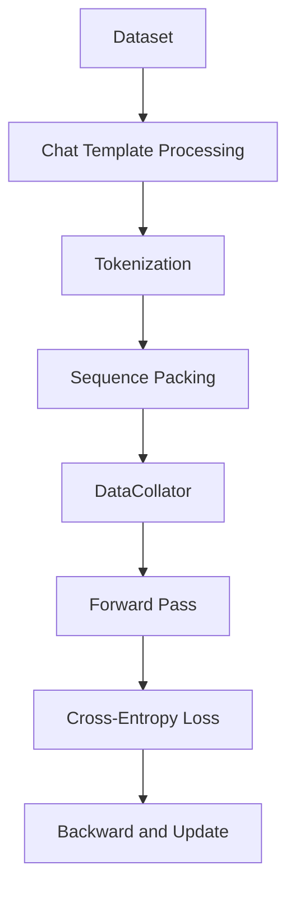

# Bài 2: SFT Trainer - Supervised Fine-Tuning Deep Dive

SFT (Supervised Fine-Tuning) là bước đầu tiên trong pipeline alignment. `SFTTrainer` trong TRL cung cấp các cơ chế xử lý dữ liệu đặc biệt cho chat-based LLM, sequence packing, và multimodal support.

---

## 1. Luồng dữ liệu trong SFTTrainer



### 1.1. Dataset formats

SFTTrainer hỗ trợ hai format dữ liệu:

**Standard format**: Text trực tiếp với cột `text`.

**Conversational format**: Structured messages với cột `messages` chứa các dict có `role` và `content`.

### 1.2. Chat template processing

Khi nhận conversational data, SFTTrainer sử dụng `apply_chat_template` để chuyển đổi messages thành token sequence. Chat template phải được áp dụng trước khi tokenize, vì template chứa các special tokens (như BOS, EOS markers) mà tokenizer cần xử lý đúng cách.

Hàm `is_conversational()` trong `data_utils.py` tự động phát hiện format dữ liệu bằng cách kiểm tra xem sample có chứa key `messages` hay không.

---

## 2. Sequence Packing

### 2.1. Vấn đề của padding

Trong SFT truyền thống, mỗi batch được pad đến chiều dài của sequence dài nhất. Với dữ liệu chat có chiều dài biến thiên lớn (từ vài chục đến vài nghìn tokens), padding gây lãng phí compute đáng kể.

### 2.2. Kỹ thuật packing

TRL cung cấp `pack_dataset()` trong `data_utils.py`:

```python
def pack_dataset(dataset, tokenizer, max_length):
    """Gộp nhiều samples ngắn thành một sequence dài max_length."""
    # Concatenate tất cả tokenized samples
    # Chia thành các chunks có độ dài max_length
    # Mỗi chunk chứa tokens từ nhiều samples khác nhau
```

**Ưu điểm**: Giảm padding waste từ 30-60% xuống gần 0%. Mỗi GPU step xử lý được nhiều thông tin hơn.

**Thách thức**: Loss computation cần cẩn thận để không tính cross-attention giữa các samples khác nhau (attention mask phải chặn attention giữa các samples).

---

## 3. Completion-only Loss

Một khía cạnh quan trọng của SFT: loss chỉ nên tính trên phần **response** (completion), không tính trên phần **prompt**.

### 3.1. Label masking

Trong quá trình tokenize, các token thuộc về prompt được gán label = -100 (ignore_index trong CrossEntropyLoss):

```python
# Pseudocode
labels = input_ids.clone()
# Mask prompt tokens
labels[:prompt_length] = -100
# Chỉ response tokens mới contribute vào loss
loss = F.cross_entropy(logits.view(-1, vocab_size), labels.view(-1))
```

### 3.2. Tại sao masking prompt tokens?

Nếu tính loss trên cả prompt, mô hình sẽ "học lại" cách dự đoán prompt tokens, điều này:
1. Lãng phí gradient signal vào phần input đã biết trước
2. Có thể gây overfitting vào format của prompt
3. Không phản ánh đúng mục tiêu: mô hình cần học sinh response tốt, không cần "học thuộc" prompt

---

## 4. Multimodal Support

SFTTrainer hỗ trợ Vision-Language Models (VLMs) thông qua `prepare_multimodal_messages`:

```python
def prepare_multimodal_messages(messages, processor):
    """Xử lý messages chứa image/video content."""
    # Extract image/video từ messages
    # Process bằng processor (AutoProcessor)
    # Trả về pixel_values, image_grid_thw, etc.
```

Khi training VLM, forward pass nhận thêm các inputs:
* `pixel_values`: Tensor chứa image features
* `image_grid_thw`: Grid dimensions cho image tiling
* `mm_token_type_ids`: Phân biệt text tokens và multimodal tokens

---

## 5. SFTConfig - Các tham số quan trọng

| Tham số | Mặc định | Mô tả |
|:---|:---|:---|
| `max_length` | 1024 | Chiều dài tối đa của sequence |
| `packing` | False | Bật/tắt sequence packing |
| `dataset_text_field` | "text" | Tên cột chứa text |
| `neftune_noise_alpha` | None | NEFTune noise injection |

### 5.1. NEFTune

NEFTune (Noisy Embedding Fine-Tuning) thêm uniform noise vào embedding trong quá trình training:

$$\tilde{e}_i = e_i + \text{Uniform}(-\alpha, \alpha)$$

Kỹ thuật đơn giản này giúp cải thiện robustness và giảm overfitting đáng kể, đặc biệt khi SFT trên dataset nhỏ.

---

## 6. Tích hợp PEFT (LoRA)

SFTTrainer hỗ trợ seamless integration với PEFT:

```python
from peft import LoraConfig
from trl import SFTTrainer

lora_config = LoraConfig(r=16, lora_alpha=32, target_modules=["q_proj", "v_proj"])
trainer = SFTTrainer(
    model="meta-llama/Llama-3-8B",
    peft_config=lora_config,
    train_dataset=dataset,
)
```

Khi PEFT được sử dụng:
1. Chỉ LoRA adapters được train, base model bị đóng băng
2. Số parameters train giảm từ hàng tỷ xuống hàng triệu
3. VRAM requirement giảm đáng kể
4. Checkpoint chỉ chứa adapter weights (vài chục MB thay vì hàng GB)

Bài tiếp theo đi sâu vào DPO và các thuật toán preference optimization.
