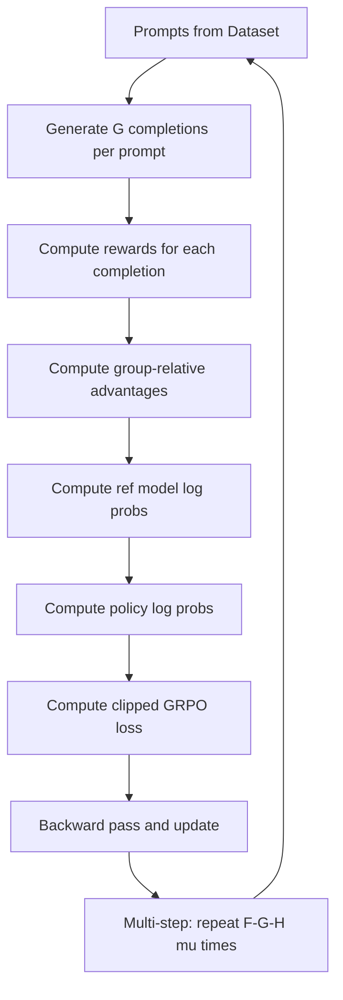
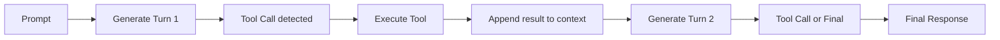

# Bài 4: GRPO Internals - Group Relative Policy Optimization

`GRPOTrainer` là trainer phức tạp nhất trong TRL với gần 2800 dòng code. Bài này phân tích toàn bộ luồng thực thi từ generation đến loss computation.

---

## 1. Tổng quan luồng GRPO



---

## 2. Phase 1: Generation (Rollout)

### 2.1. RepeatSampler

Mỗi prompt được nhân bản G lần (num_generations) để sinh ra nhóm responses:

```python
class RepeatSampler(Sampler):
    """Lặp lại mỗi index G lần: [0,1,2] -> [0,0,0,1,1,1,2,2,2]"""
    def __iter__(self):
        for idx in super().__iter__():
            for _ in range(self.num_generations):
                yield idx
```

### 2.2. Hai chế độ generation

**Chế độ 1: Transformers generate (mặc định)**

Sử dụng `model.generate()` với sampling parameters:
```python
generation_config = GenerationConfig(
    max_new_tokens=self.max_completion_length,
    temperature=self.temperature,
    top_p=self.top_p,
    top_k=self.top_k,
    do_sample=True,
)
```

**Chế độ 2: vLLM generation**

Sử dụng `VLLMGeneration` cho tốc độ cao hơn đáng kể (PagedAttention, continuous batching):
```python
if self.use_vllm:
    vllm_gen = VLLMGeneration(model, vllm_config)
    outputs = vllm_gen.generate(prompts, sampling_params)
```

### 2.3. _generate_single_turn

Phương thức `_generate_single_turn` xử lý generation một lượt:

```python
def _generate_single_turn(self, prompt_ids, images, multimodal_fields):
    # 1. Prepare generation inputs
    # 2. Handle multimodal inputs (VLM support)
    # 3. Call model.generate() or vLLM
    # 4. Extract completion_ids, logprobs
    # 5. Mask prompt tokens in output
    return completion_ids, completion_mask, old_logprobs
```

### 2.4. Multi-turn generation với tool calling

Khi `tools` được cung cấp, GRPOTrainer hỗ trợ generation đa lượt:



Mỗi environment instance (từ `environment_factory`) có state riêng biệt, cho phép parallel independent interactions.

---

## 3. Phase 2: Reward Computation

### 3.1. Reward function types

`RewardFunc` có ba dạng:

```python
RewardFunc = str | PreTrainedModel | Callable[..., list[float | None]]
```

* **String**: Model ID, được load thành `AutoModelForSequenceClassification`
* **PreTrainedModel**: Reward model đã load sẵn
* **Callable**: Custom reward function nhận (completions, prompts, **kwargs)

### 3.2. Multi-reward aggregation

```python
# Mỗi reward function trả về list[float]
rewards_1 = reward_func_1(completions, prompts, ...)
rewards_2 = reward_func_2(completions, prompts, ...)

# Aggregation strategies
if multi_objective_aggregation == "sum":
    total_rewards = [r1 + r2 for r1, r2 in zip(rewards_1, rewards_2)]
elif multi_objective_aggregation == "mean":
    total_rewards = [(r1 + r2) / 2 for r1, r2 in zip(rewards_1, rewards_2)]
```

### 3.3. Async reward support

Khi reward function là async (ví dụ: gọi API bên ngoài):

```python
if self._has_async_funcs:
    # Event loop chạy trên daemon thread
    rewards = asyncio.run_coroutine_threadsafe(
        async_reward_func(completions), self.async_loop
    ).result()
```

### 3.4. None reward handling

Reward function có thể trả `None` cho một số samples (không applicable):

```python
# Khi reward = None, sample đó bị exclude khỏi reward trung bình
# Chỉ tính mean/std trên các reward không None
valid_rewards = [r for r in rewards if r is not None]
```

---

## 4. Phase 3: Advantage Computation

### 4.1. Group-relative normalization

Với $G$ completions cho cùng prompt, advantage được tính:

$$A_i = \frac{r_i - \text{mean}(\{r_1,...,r_G\})}{\text{std}(\{r_1,...,r_G\}) + \epsilon}$$

```python
# Pseudocode trong _generate_and_score_completions
rewards_grouped = rewards.reshape(num_prompts, num_generations)
mean = rewards_grouped.mean(dim=1, keepdim=True)
std = rewards_grouped.std(dim=1, keepdim=True)
advantages = (rewards_grouped - mean) / (std + 1e-8)
advantages = advantages.flatten()  # shape: [num_prompts * num_generations]
```

### 4.2. Reward scaling

```python
if self.scale_rewards == "group":
    # Scale advantage by group std (mặc định)
    advantages = advantages / (group_std + 1e-8)
elif self.scale_rewards == "none":
    # Không scale, giữ nguyên raw reward
    pass
```

---

## 5. Phase 4: Loss Computation

### 5.1. Standard GRPO loss

```python
def _compute_loss(self, model, inputs):
    # Forward pass để lấy per_token_logps
    per_token_logps, entropies = self._get_per_token_logps_and_entropies(
        model, input_ids, attention_mask, logits_to_keep
    )
    
    # Importance ratio
    old_per_token_logps = inputs.get("old_per_token_logps")
    if old_per_token_logps is None:
        old_per_token_logps = per_token_logps.detach()
    
    log_ratio = per_token_logps - old_per_token_logps
    
    # Clipped surrogate
    coef_1 = torch.exp(log_ratio)
    coef_2 = torch.clamp(coef_1, 1 - epsilon_low, 1 + epsilon_high)
    
    advantages = inputs["advantages"].unsqueeze(1)  # (B, 1)
    loss1 = coef_1 * advantages
    loss2 = coef_2 * advantages
    per_token_loss = -torch.min(loss1, loss2)
    
    # KL penalty (Schulman approximation)
    if self.beta != 0.0:
        ref_logps = inputs["ref_per_token_logps"]
        kl = torch.exp(ref_logps - per_token_logps) - (ref_logps - per_token_logps) - 1
        per_token_loss = per_token_loss + self.beta * kl
    
    # Masked mean
    loss = (per_token_loss * completion_mask).sum() / completion_mask.sum()
    return loss
```

### 5.2. Các biến thể loss

GRPOTrainer hỗ trợ **8 loại loss** khác nhau:

| Loss Type | Đặc điểm |
|:---|:---|
| `grpo` | Standard clipped surrogate |
| `dapo` | Dynamic advantage per-token (thay vì per-sequence) |
| `bnpo` | Batch-normalized GRPO |
| `dr_grpo` | Doubly-robust GRPO với delta clipping |
| `cispo` | Clipped IS với one-sided clipping |
| `luspo` | Length-Unbiased Sequence-level PO |
| `sapo` | Soft Annealed PO (sigmoid thay vì clamp) |
| `vespo` | Variance-reduced ESPO với gamma weights |

### 5.3. VESPO loss

VESPO sử dụng gamma weights để giảm variance:

$$\phi(w) = e^\lambda \cdot w^k \cdot e^{-\lambda w}$$

Với $w$ là sequence-level importance ratio. Hàm gamma này normalized sao cho $\phi(1) = 1$.

```python
# log-space computation để tránh overflow
log_phi = lambda_seq + k_seq * log_w_seq - lambda_seq * w_seq
phi_seq = torch.exp(log_phi).nan_to_num(nan=0.0, posinf=0.0, neginf=0.0)
```

### 5.4. SAPO loss

SAPO thay thế hard clipping bằng sigmoid:

$$\text{soft\_coef} = \frac{4}{\tau} \cdot \sigma(\tau \cdot (\rho - 1))$$

Với $\tau$ là temperature parameter, $\tau > 0$ cho positive advantages và $\tau < 0$ cho negative advantages.

---

## 6. Phase 5: Multi-step Updates

GRPO hỗ trợ $\mu$ (num_iterations) gradient updates trên cùng một batch completions:

```python
self.num_iterations = args.num_iterations  # = mu

# Trong _get_train_sampler và _prepare_inputs:
# Lần đầu: generate completions, compute rewards, advantages
# Các lần sau (iteration 2..mu): reuse completions, chỉ recompute logps
```

Điều này tăng sample efficiency: mỗi completion được dùng $\mu$ lần để cập nhật policy.

**Caveat**: Sau $\mu$ updates, policy đã thay đổi, nên importance sampling correction (qua log ratio) trở nên quan trọng để tránh off-policy bias.

---

## 7. KL Penalty Variants

### 7.1. Schulman KL approximation (mặc định)

$$D_{KL}^{Schulman} = \frac{\pi_{ref}}{\pi_\theta} - \log\frac{\pi_{ref}}{\pi_\theta} - 1$$

Đây là xấp xỉ bậc hai của KL divergence, luôn không âm và bằng 0 khi hai distribution bằng nhau.

### 7.2. Bias correction cho KL

Khi sử dụng importance sampling, KL divergence cần được hiệu chỉnh:

```python
if self.args.use_bias_correction_kl:
    per_token_kl = per_token_kl * coef_1  # Multiply by IS ratio
```

---

## 8. Off-Policy Sequence Masking (OPSM)

Từ DeepSeek-V3.2 paper, OPSM loại bỏ các sequence quá "off-policy":

```python
def get_off_policy_mask(advantages, per_token_logps, sampling_logps, mask, threshold):
    # Forward KL: log(pi_old) - log(pi_theta)
    kl_div = sampling_logps - per_token_logps.detach()
    avg_seq_kl = (kl_div * mask).sum(dim=1) / mask.sum(dim=1)
    
    # Keep nếu advantage >= 0 HOẶC KL <= threshold
    keep = (advantages >= 0) | (avg_seq_kl <= threshold)
    return keep.float().unsqueeze(1)
```

Bài tiếp theo phân tích PPO và các trainer trong experimental/.
