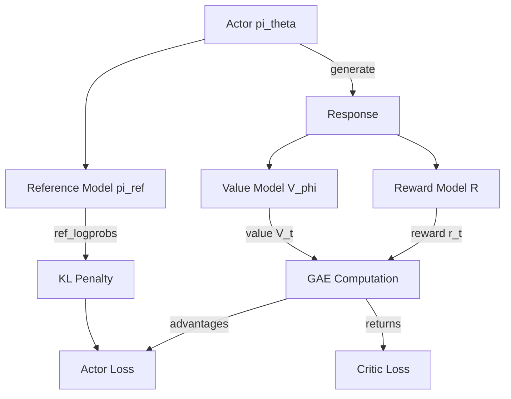

# Bài 5: PPO & Online RL - Experimental Trainers

PPO (Proximal Policy Optimization) là thuật toán RLHF kinh điển, được OpenAI dùng cho ChatGPT. Trong TRL, PPO nằm ở `trl/experimental/`, cho thấy nó đang được cải tiến và chưa đạt stable API.

---

## 1. Kiến trúc PPOTrainer

Khác với các trainer stable (kế thừa `transformers.Trainer`), PPOTrainer tự quản lý training loop:

```python
class PPOTrainer(_BaseTrainer):
    """PPO sử dụng Accelerator trực tiếp thay vì HF Trainer loop."""
    
    def __init__(self, config, model, ref_model, reward_model, ...):
        # 4 models: policy, reference, reward, value (critic)
        self.model = model           # Actor (policy)
        self.ref_model = ref_model   # Reference (frozen)
        self.reward_model = reward_model  # Reward network
        self.value_model = value_model    # Critic (value network)
```

### 1.1. Tại sao PPO cần 4 mô hình?



* **Actor**: Sinh response, compute policy gradient
* **Reference**: KL constraint, ngăn policy drift
* **Reward model**: Đánh giá chất lượng response
* **Critic (Value)**: Ước lượng baseline, giảm variance của gradient

---

## 2. Rollout Buffer

### 2.1. Generation phase

```python
def generate(lm_backbone, queries, pad_token_id, generation_config):
    """Sinh responses từ actor model."""
    with unwrap_model_for_generation(lm_backbone):
        responses = lm_backbone.generate(
            queries, 
            generation_config=generation_config,
            pad_token_id=pad_token_id,
        )
    return responses
```

### 2.2. Buffer structure

Sau generation, tất cả thông tin cần thiết được lưu vào buffer:

```python
# Mỗi step lưu vào dict:
{
    "queries": query_ids,          # [B, prompt_len]
    "responses": response_ids,     # [B, response_len]
    "logprobs": old_logprobs,      # [B, response_len] from actor
    "ref_logprobs": ref_logprobs,  # [B, response_len] from reference
    "values": values,              # [B, response_len] from critic
    "rewards": rewards,            # [B] from reward model
}
```

---

## 3. GAE (Generalized Advantage Estimation)

### 3.1. Công thức GAE

$$\hat{A}_t^{GAE(\gamma, \lambda)} = \sum_{l=0}^{T-t} (\gamma \lambda)^l \delta_{t+l}$$

Với temporal difference error:

$$\delta_t = r_t + \gamma V(s_{t+1}) - V(s_t)$$

Trong đó:
* $\gamma \in [0, 1]$ là discount factor
* $\lambda \in [0, 1]$ là GAE lambda (bias-variance tradeoff)
* $r_t$ là reward tại token $t$ (bao gồm KL penalty)

### 3.2. Hiện thực GAE trong PPOTrainer

```python
def compute_gae(rewards, values, gamma=0.99, lam=0.95):
    """Tính GAE advantages và returns."""
    advantages = torch.zeros_like(rewards)
    last_gae = 0
    
    for t in reversed(range(len(rewards))):
        delta = rewards[t] + gamma * values[t+1] - values[t]
        last_gae = delta + gamma * lam * last_gae
        advantages[t] = last_gae
    
    returns = advantages + values
    return advantages, returns
```

---

## 4. PPO Update

### 4.1. Clipped surrogate objective

```python
def ppo_update(model, old_logprobs, advantages, returns, values, ...):
    # Forward pass with current policy
    new_logprobs = selective_log_softmax(logits, tokens)
    
    # Probability ratio
    ratio = torch.exp(new_logprobs - old_logprobs)
    
    # Clipped surrogate
    surr1 = ratio * advantages
    surr2 = torch.clamp(ratio, 1 - clip_range, 1 + clip_range) * advantages
    actor_loss = -torch.min(surr1, surr2).mean()
    
    # Value loss (critic)
    value_loss = F.mse_loss(predicted_values, returns)
    
    # Total loss
    loss = actor_loss + vf_coef * value_loss
    loss.backward()
```

### 4.2. Multiple PPO epochs

Mỗi batch data được dùng cho `num_ppo_epochs` lần update:

```python
for epoch in range(num_ppo_epochs):
    for batch in dataloader:
        ppo_update(model, batch)
```

---

## 5. So sánh PPO vs GRPO trong TRL

| Tiêu chí | PPO (experimental) | GRPO (stable) |
|:---|:---|:---|
| Số mô hình | 4 (actor, ref, critic, reward) | 2-3 (policy, ref, reward) |
| VRAM | Rất cao | Thấp hơn 30-40% |
| Training loop | Custom (Accelerator) | HF Trainer |
| Baseline | Critic (value network) | Group mean reward |
| API stability | Experimental, có thể thay đổi | Stable, backward compatible |
| vLLM support | Không | Có (colocation mode) |
| Tool calling | Không | Có (multi-turn) |

**Xu hướng**: GRPO đang thay thế PPO trong đa số use cases nhờ đơn giản hơn, tốn ít VRAM hơn, và performance tương đương hoặc tốt hơn cho reasoning tasks.

---

## 6. Các trainer experimental khác

### 6.1. Online DPO

Kết hợp online generation với DPO loss:
1. Generate N responses per prompt
2. Chọn best/worst response dựa trên reward
3. Train DPO trên cặp (best, worst)

### 6.2. BCO (Binary Classifier Optimization)

Sử dụng binary classifier thay vì reward model:

$$L_{BCO} = -\mathbb{E}[\log \sigma(f(x, y))] \text{ for good} - \mathbb{E}[\log(1 - \sigma(f(x, y)))] \text{ for bad}$$

### 6.3. Nash MD

Nash equilibrium-based training cho multi-player preference games.

---

## Xem thêm

- [Lý thuyết 1: PPO Mathematics](./theory_deep_dive/theory_1_ppo_math.md): GAE derivation và clipped surrogate objective
- [Experiment: GRPO vs DPO](./experiments_deep_dive/exp_1_grpo_vs_dpo.md): So sánh online RL (GRPO) và offline (DPO)

Bài tiếp theo phân tích hệ thống reward engineering trong TRL.
