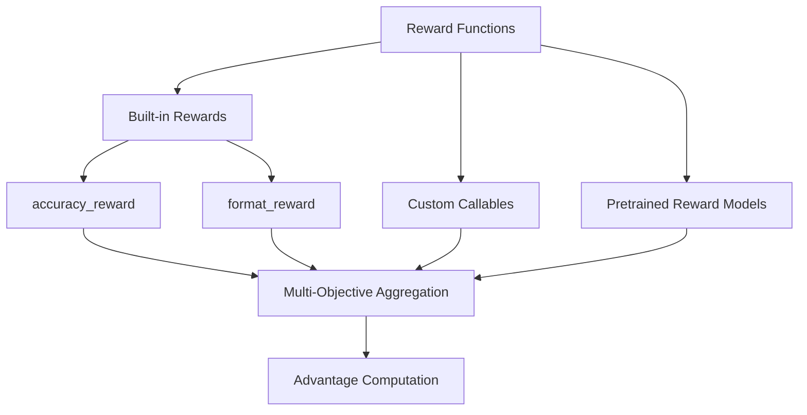

# Bài 6: Reward Engineering & Verification

Reward function là trái tim của RL-based alignment. TRL cung cấp hệ thống reward linh hoạt: từ built-in accuracy/format rewards đến custom reward functions và async rewards.

---

## 1. Hệ thống Reward trong TRL



---

## 2. accuracy_reward - Rule-based Verification

`accuracy_reward` sử dụng thư viện `math_verify` để so sánh đáp án của model với ground truth. Pipeline gồm 3 bước:

1. **Parse ground truth**: Chuyển LaTeX string thành symbolic expression
2. **Extract prediction**: Tìm đáp án trong `\boxed{}` hoặc extract LaTeX
3. **Verify**: So sánh symbolic equivalence (ví dụ: 1/2 = 0.5)

Khi ground truth không parse được (malformed LaTeX), reward trả về `None` và sample đó bị loại khỏi group mean/std computation trong GRPO.

Timeout protection: `math_verify` sử dụng `signal.alarm()` cho parsing (10s) và verification (5s). Khi chạy trên non-main thread (async reward), timeout bị vô hiệu hóa để tránh `ValueError`.

---

## 3. format_reward - Structural Validation

`format_reward` kiểm tra response có tuân thủ format yêu cầu, ví dụ: phải có thẻ `<think>...</think>` trong reasoning models.

```python
def format_reward(completions, **kwargs):
    """Regex check format structure."""
    rewards = []
    for completion in completions:
        content = completion[0]["content"]
        # Check for think/answer pattern
        has_think = bool(re.search(
            r"<think>[\s\S]*?<\/think>[\s\S]*?", content
        ))
        rewards.append(1.0 if has_think else 0.0)
    return rewards
```

---

## 4. Custom Reward Functions

### 4.1. Signature chuẩn

```python
def my_reward(
    completions: list[list[dict[str, str]]],
    prompts: list[str],
    solution: list[str],        # Optional: ground truth
    trainer_state=None,         # Optional: TrainerState
    **kwargs                    # Forward compatibility
) -> list[float | None]:
    """Custom reward function."""
    rewards = []
    for completion, prompt in zip(completions, prompts):
        content = completion[0]["content"]
        score = evaluate(content)
        rewards.append(score)
    return rewards
```

### 4.2. Dataset column passthrough

Custom reward functions có thể nhận **bất kỳ cột nào** từ dataset:

```python
# Dataset có cột: prompt, solution, difficulty
# Reward function có thể dùng difficulty:
def difficulty_weighted_reward(completions, solution, difficulty, **kwargs):
    base_reward = check_answer(completions, solution)
    return [r * d for r, d in zip(base_reward, difficulty)]
```

Điều này khả thi nhờ GRPOTrainer đặt `remove_unused_columns=False` mặc định khi custom reward functions được cung cấp.

---

## 5. Async Rewards

Khi reward function cần gọi API bên ngoài (code execution, web scraping):

```python
async def async_code_reward(completions, **kwargs):
    """Gọi code execution API để chấm điểm."""
    tasks = []
    for completion in completions:
        code = extract_code(completion[0]["content"])
        tasks.append(run_code_async(code))
    
    results = await asyncio.gather(*tasks)
    return [1.0 if r.passed else 0.0 for r in results]
```

GRPOTrainer tự động phát hiện async functions và khởi tạo event loop trên daemon thread:

```python
# Trong GRPOTrainer.__init__
if self._has_async_funcs:
    self.async_loop_thread, self.async_loop, self.async_loop_ready_event = \
        start_event_loop_in_daemon(name="GRPOTrainer-AsyncLoop")
    atexit.register(shutdown_event_loop_in_daemon, ...)
```

---

## 6. Multi-Objective Aggregation

### 6.1. Sum aggregation (mặc định)

```python
# Nhiều reward functions, sum lại
total_reward = sum(reward_i for reward_i in all_rewards)
```

### 6.2. Mean aggregation

```python
total_reward = mean(reward_i for reward_i in all_rewards)
```

### 6.3. Use case: Math + Format + Length

```python
trainer = GRPOTrainer(
    model="Qwen/Qwen2.5-7B",
    reward_funcs=[
        accuracy_reward,     # 1.0 nếu đúng, 0.0 nếu sai
        format_reward,       # 1.0 nếu đúng format
        lambda completions, **kw: [-0.001 * len(c[0]["content"]) for c in completions],  # Length penalty
    ],
    multi_objective_aggregation="sum",
)
```

---

## 7. Reward Model Integration

### 7.1. String reward (auto-load)

```python
trainer = GRPOTrainer(
    model="Qwen/Qwen2.5-7B",
    reward_funcs="OpenRLHF/Llama-3-8B-Reward",  # Auto-loaded
    train_dataset=dataset,
)
```

TRL tự động load model thành `AutoModelForSequenceClassification(num_labels=1)`.

### 7.2. Pre-loaded model

```python
from transformers import AutoModelForSequenceClassification
reward_model = AutoModelForSequenceClassification.from_pretrained(
    "reward-model-id", num_labels=1
)
trainer = GRPOTrainer(
    model="Qwen/Qwen2.5-7B",
    reward_funcs=reward_model,
    reward_processing_classes=reward_tokenizer,
)
```

---

## 8. Practical Reward Design Checklist

1. **Accuracy first**: Dùng rule-based reward (math_verify, code execution) khi có thể
2. **Format enforcement**: format_reward giúp model tuân thủ structure mong muốn
3. **Length control**: Length penalty tránh response quá dài hoặc quá ngắn
4. **Reward hacking prevention**: Monitor reward distribution, nếu reward tăng quá nhanh mà chất lượng không cải thiện, có thể bị reward hacking
5. **Multi-objective balance**: Scale các reward component về cùng magnitude (thường [0, 1])
6. **Async for external tools**: Dùng async reward cho code execution, API calls

Bài tiếp theo phân tích vLLM integration và generation optimization.
