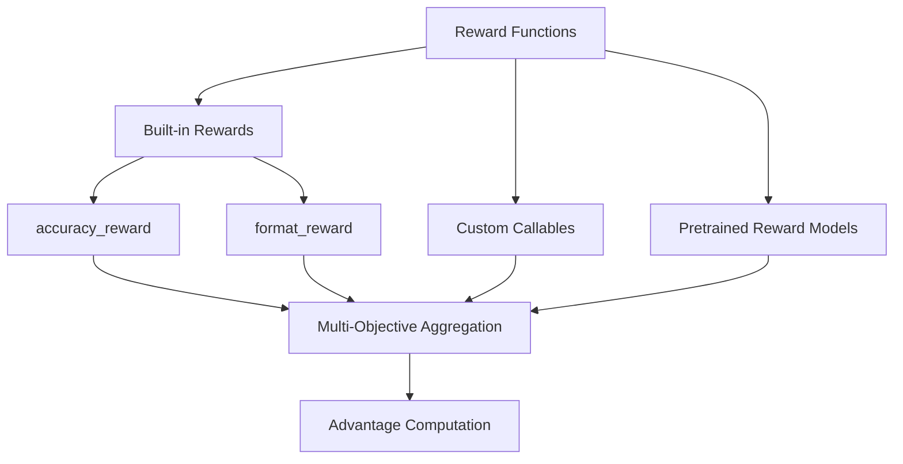

# Bài 6: Reward Engineering & Verification

Reward function là trái tim của RL-based alignment. TRL cung cấp hệ thống reward linh hoạt: từ built-in accuracy/format rewards đến custom reward functions và async rewards.

---

## 1. Hệ thống Reward trong TRL



---

## 2. accuracy_reward - Rule-based Verification

`accuracy_reward` sử dụng thư viện `math_verify` để so sánh đáp án của model với ground truth. Pipeline gồm 3 bước:

1. **Parse ground truth**: Chuyển LaTeX string thành symbolic expression
2. **Extract prediction**: Tìm đáp án trong `\boxed{}` hoặc extract LaTeX
3. **Verify**: So sánh symbolic equivalence (ví dụ: 1/2 = 0.5)

Khi ground truth không parse được (malformed LaTeX), reward trả về `None` và sample đó bị loại khỏi group mean/std computation trong GRPO.

Timeout protection: `math_verify` sử dụng `signal.alarm()` cho parsing (10s) và verification (5s). Khi chạy trên non-main thread (async reward), timeout bị vô hiệu hóa để tránh `ValueError`.

---

## 3. format_reward - Structural Validation

`format_reward` kiểm tra response có tuân thủ format yêu cầu, ví dụ: phải có thẻ `<think>...</think>` trong reasoning models.

```python
def format_reward(completions, **kwargs):
    """Regex check format structure."""
    rewards = []
    for completion in completions:
        content = completion[0]["content"]
        # Check for think/answer pattern
        has_think = bool(re.search(
            r"<think>[\s\S]*?<\/think>[\s\S]*?", content
        ))
        rewards.append(1.0 if has_think else 0.0)
    return rewards
```

---

## 4. Custom Reward Functions

### 4.1. Signature chuẩn

```python
def my_reward(
    completions: list[list[dict[str, str]]],
    prompts: list[str],
    solution: list[str],        # Optional: ground truth
    trainer_state=None,         # Optional: TrainerState
    **kwargs                    # Forward compatibility
) -> list[float | None]:
    """Custom reward function."""
    rewards = []
    for completion, prompt in zip(completions, prompts):
        content = completion[0]["content"]
        score = evaluate(content)
        rewards.append(score)
    return rewards
```

### 4.2. Dataset column passthrough

Custom reward functions có thể nhận **bất kỳ cột nào** từ dataset:

```python
# Dataset có cột: prompt, solution, difficulty
# Reward function có thể dùng difficulty:
def difficulty_weighted_reward(completions, solution, difficulty, **kwargs):
    base_reward = check_answer(completions, solution)
    return [r * d for r, d in zip(base_reward, difficulty)]
```

Điều này khả thi nhờ GRPOTrainer đặt `remove_unused_columns=False` mặc định khi custom reward functions được cung cấp.

---

## 5. Async Rewards

Khi reward function cần gọi API bên ngoài (code execution, web scraping):

```python
async def async_code_reward(completions, **kwargs):
    """Gọi code execution API để chấm điểm."""
    tasks = []
    for completion in completions:
        code = extract_code(completion[0]["content"])
        tasks.append(run_code_async(code))
    
    results = await asyncio.gather(*tasks)
    return [1.0 if r.passed else 0.0 for r in results]
```

GRPOTrainer tự động phát hiện async functions và khởi tạo event loop trên daemon thread:

```python
# Trong GRPOTrainer.__init__
if self._has_async_funcs:
    self.async_loop_thread, self.async_loop, self.async_loop_ready_event = \
        start_event_loop_in_daemon(name="GRPOTrainer-AsyncLoop")
    atexit.register(shutdown_event_loop_in_daemon, ...)
```

---

## 6. Multi-Objective Aggregation

### 6.1. Sum aggregation (mặc định)

```python
# Nhiều reward functions, sum lại
total_reward = sum(reward_i for reward_i in all_rewards)
```

### 6.2. Mean aggregation

```python
total_reward = mean(reward_i for reward_i in all_rewards)
```

### 6.3. Use case: Math + Format + Length

```python
trainer = GRPOTrainer(
    model="Qwen/Qwen2.5-7B",
    reward_funcs=[
        accuracy_reward,     # 1.0 nếu đúng, 0.0 nếu sai
        format_reward,       # 1.0 nếu đúng format
        lambda completions, **kw: [-0.001 * len(c[0]["content"]) for c in completions],  # Length penalty
    ],
    multi_objective_aggregation="sum",
)
```

---

## 7. Reward Model Integration

### 7.1. String reward (auto-load)

```python
trainer = GRPOTrainer(
    model="Qwen/Qwen2.5-7B",
    reward_funcs="OpenRLHF/Llama-3-8B-Reward",  # Auto-loaded
    train_dataset=dataset,
)
```

TRL tự động load model thành `AutoModelForSequenceClassification(num_labels=1)`.

### 7.2. Pre-loaded model

```python
from transformers import AutoModelForSequenceClassification
reward_model = AutoModelForSequenceClassification.from_pretrained(
    "reward-model-id", num_labels=1
)
trainer = GRPOTrainer(
    model="Qwen/Qwen2.5-7B",
    reward_funcs=reward_model,
    reward_processing_classes=reward_tokenizer,
)
```

---

## 8. Practical Reward Design Checklist

1. **Accuracy first**: Dùng rule-based reward (math_verify, code execution) khi có thể
2. **Format enforcement**: format_reward giúp model tuân thủ structure mong muốn
3. **Length control**: Length penalty tránh response quá dài hoặc quá ngắn
4. **Reward hacking prevention**: Monitor reward distribution, nếu reward tăng quá nhanh mà chất lượng không cải thiện, có thể bị reward hacking
5. **Multi-objective balance**: Scale các reward component về cùng magnitude (thường [0, 1])
6. **Async for external tools**: Dùng async reward cho code execution, API calls

---

## 9. RewardTrainer: Train Reward Model từ Preference Data

Trước khi dùng reward model trong GRPO/PPO, ai đó phải train nó. `RewardTrainer` (712 dòng, `reward_trainer.py`) đảm nhận việc này.

### 9.1. Bradley-Terry Loss

Reward model học cách phân biệt "chosen" (tốt) và "rejected" (xấu):

$$L = -\log\sigma(R(x, y_w) - R(x, y_l) - m)$$

với $m$ là margin optional.

```python
# reward_trainer.py, lines 645-659
rewards_chosen, rewards_rejected = torch.chunk(outputs.logits.squeeze(-1), chunks=2)

if "margin" in inputs:
    loss = -logsigmoid(rewards_chosen - rewards_rejected - inputs["margin"]).mean()
else:
    loss = -logsigmoid(rewards_chosen - rewards_rejected).mean()

# Center rewards regularization (optional)
if self.args.center_rewards_coefficient is not None:
    loss += coeff * torch.mean((rewards_chosen + rewards_rejected) ** 2)
```

`center_rewards_coefficient` điều chỉnh reward về 0 mean, tránh reward drift.

### 9.2. Data Format và Evaluation

Dataset cần các cột: `chosen_ids`, `rejected_ids`, `attention_mask`, và optional `margin`.

**Evaluation metrics**:
- **Accuracy**: tỉ lệ `chosen > rejected`
- **Margin**: `mean(R_chosen - R_rejected)`
- **Min/Mean/Max reward**: monitor reward distribution

```python
from trl import RewardTrainer, RewardConfig

trainer = RewardTrainer(
    model="meta-llama/Llama-3-8B",
    args=RewardConfig(
        max_length=512,
        center_rewards_coefficient=0.01,
    ),
    train_dataset=preference_dataset,
    processing_class=tokenizer,
)
trainer.train()
# Sau đó dùng reward model trong GRPOTrainer:
# reward_funcs = AutoModelForSequenceClassification.from_pretrained("./reward_model")
```

---

## 10. Callbacks: Monitoring và Observability

TRL cung cấp nhiều callbacks để monitor training (xem `callbacks.py`, 759 dòng).

### 10.1. SyncRefModelCallback (EMA Sync)

Dùng khi reference model cần track policy model qua EMA:

$$\theta_{\text{ref}} \leftarrow (1-\alpha)\theta_{\text{ref}} + \alpha\theta_{\text{policy}}$$

```python
# callbacks.py, lines 102-140
class SyncRefModelCallback(TrainerCallback):
    def on_step_end(self, args, state, control, **kwargs):
        if state.global_step % args.ref_model_sync_steps == 0:
            self.sync_target_model(model, self.ref_model, args.ref_model_mixup_alpha)

    @staticmethod
    def _sync_target_model(model, target_model, alpha):
        for target_param, copy_param in zip(target_model.parameters(), model.parameters()):
            target_param.data.mul_(1.0 - alpha).add_(copy_param.data, alpha=alpha)
```

Hỗ trợ DeepSpeed ZeRO-3 (gathered parameters) và DDP/FSDP.

### 10.2. LogCompletionsCallback

Generate và log completions lên W&B/Comet tại eval time, giúp visualize chất lượng response qua training:

```python
from trl import LogCompletionsCallback

trainer = GRPOTrainer(...)
trainer.add_callback(LogCompletionsCallback(trainer=trainer, num_prompts=8))
```

### 10.3. RichProgressCallback

Terminal progress display dùng Rich library, hiển thị metrics grouped theo category trong panels:

```python
from trl import RichProgressCallback
trainer = GRPOTrainer(..., callbacks=[RichProgressCallback()])
```

### 10.4. BEMACallback (Bias-Corrected EMA)

Kỹ thuật tiên tiến cho weight averaging:

$$\theta'_t = \alpha_t(\theta_t - \theta_0) + \text{EMA}_t$$

với $\alpha_t = (\rho + \gamma t)^{-\eta}$ và $\text{EMA}_t = (1-\beta_t)\text{EMA}_{t-1} + \beta_t\theta_t$.

BEMA tốt hơn EMA thông thường cho long-horizon training vì nó bias-correct và decay schedule adaptive.

```python
from trl import BEMACallback
trainer = GRPOTrainer(..., callbacks=[BEMACallback(update_freq=400, ema_power=0.5)])
```

### 10.5. Khi nào dùng callback nào?

| Callback | Use case |
|:---|:---|
| SyncRefModelCallback | Reference model cần track policy (DPO, PPO) |
| LogCompletionsCallback | Monitor response quality trong training |
| RichProgressCallback | Better terminal UX |
| BEMACallback | Long training runs, research experiments |

---

## Xem thêm

- [Case Study: DeepSeek-R1 GRPO](./case_studies/case_1_deepseek_r1_grpo.md): Cách DeepSeek-R1 kết hợp accuracy_reward + format_reward

Bài tiếp theo phân tích vLLM integration và generation optimization.
