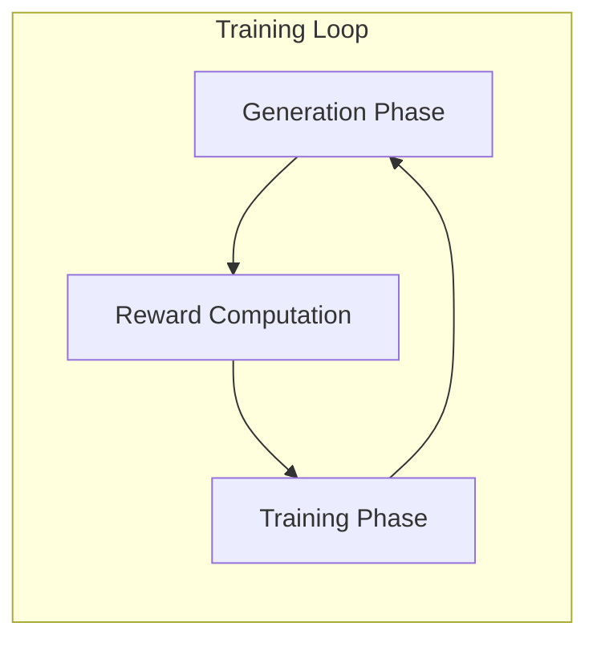
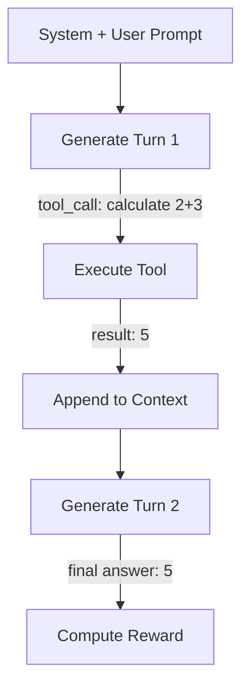

# Bài 7: vLLM Integration & Generation Optimization

Generation là phase tốn thời gian nhất trong RL training. TRL tích hợp vLLM để tăng tốc generation lên 5-10x, với cơ chế importance sampling correction để bù đắp training-inference mismatch.

---

## 1. Vấn đề Generation trong RL Training



Generation chiếm 60-80% thời gian mỗi RL step vì:
1. **Autoregressive**: Phải sinh từng token một
2. **Multiple samples**: GRPO cần G=8-16 samples per prompt
3. **HF generate chậm**: Không có PagedAttention, continuous batching

---

## 2. VLLMGeneration Architecture

### 2.1. Hai chế độ hoạt động

**Colocation mode** (vLLM chạy trên cùng GPU với training):

```python
class VLLMGeneration:
    def __init__(self, model, vllm_config):
        self.vllm_mode = "colocate"
        self.gpu_memory_utilization = vllm_gpu_memory_utilization  # e.g., 0.3
        self.tensor_parallel_size = vllm_tensor_parallel_size
```

VRAM được chia: training chiếm ~70%, vLLM chiếm ~30% (configurable).

**Server mode** (vLLM chạy trên GPU riêng):

```python
# vLLM chạy trên server riêng, trainer giao tiếp qua HTTP
vllm_client = VLLMClient(base_url="http://localhost:8000")
```

### 2.2. Weight synchronization

Trong colocation mode, trọng số model training và vLLM engine phải được đồng bộ:

```python
def sync_weights(training_model, vllm_engine):
    """Copy weights từ training model sang vLLM engine.
    
    Thực hiện sau mỗi training step, trước generation phase.
    Sử dụng efficient weight update (không copy qua CPU).
    """
    for name, param in training_model.named_parameters():
        vllm_engine.update_model_param(name, param.data)
```

---

## 3. Importance Sampling Correction

### 3.1. Vấn đề training-inference mismatch

Khi dùng vLLM, logprobs từ generation engine (vLLM) khác với logprobs từ training model (HF Transformers) do:

1. **Numerical precision**: vLLM dùng optimized kernels (FlashAttention, PagedAttention)
2. **Quantization**: vLLM có thể dùng quantized weights
3. **Sampling implementation**: Khác nhau giữa HF generate và vLLM sampling

Hệ quả: `old_per_token_logps` (từ generation) không khớp với `per_token_logps` (từ training forward pass).

### 3.2. Correction mechanism

```python
# Trong GRPOTrainer._generate_and_score_completions
if self.use_vllm and self.vllm_importance_sampling_correction:
    # vLLM logprobs
    vllm_logprobs = generation_output.logprobs
    
    # Training model logprobs (recompute)
    with torch.no_grad():
        model_logprobs = selective_log_softmax(logits, completion_ids)
    
    # IS ratio: pi_training / pi_vllm
    importance_ratio = torch.exp(model_logprobs - vllm_logprobs)
    
    # Apply correction to loss
    per_token_loss = per_token_loss * importance_ratio
```

### 3.3. IS correction modes

```python
vllm_importance_sampling_mode: str
# "token_truncate": Clamp IS ratio từ trên (giảm variance)
# "token_mask": Mask tokens có IS ratio quá lớn
# "sequence_truncate": Clamp sequence-level IS ratio
```

---

## 4. Off-Policy Sequence Masking (OPSM)

### 4.1. Hai nguồn off-policyness

1. **Drift từ gradient updates**: Policy thay đổi sau mỗi step, completions cũ trở nên off-policy
2. **Training-inference mismatch**: vLLM generation khác với training model

### 4.2. OPSM algorithm

```python
@staticmethod
def get_off_policy_mask(advantages, per_token_logps, sampling_logps, mask, threshold):
    """OPSM từ DeepSeek-V3.2 paper.
    
    Returns: (B, 1) mask tensor. 1.0 = Keep, 0.0 = Drop.
    """
    # Forward KL divergence (per token)
    kl_div = sampling_logps - per_token_logps.detach()
    
    # Sequence-level average KL
    seq_kl = (kl_div * mask).sum(dim=1, keepdim=True) / mask.sum(dim=1, keepdim=True)
    
    # Decision: Keep nếu advantage >= 0 OR KL <= threshold
    is_positive_advantage = advantages >= 0
    is_low_kl = seq_kl <= threshold
    
    return (is_positive_advantage | is_low_kl).float()
```

**Intuition**: 
* Positive advantage completions luôn được giữ (chúng tốt hơn baseline)
* Negative advantage completions chỉ được giữ nếu KL đủ nhỏ (không quá off-policy)

---

## 5. Liger Kernel Integration

### 5.1. Fused loss computation

Liger Kernel cung cấp fused implementation của GRPO loss, giảm VRAM và tăng tốc:

```python
if self.use_liger_kernel:
    from liger_kernel.chunked_loss import LigerFusedLinearGRPOLoss
    
    # Fused: forward + log_softmax + loss trong một CUDA kernel
    # Tránh materialize full logits tensor [B, T, V]
    loss = LigerFusedLinearGRPOLoss(
        weight=model.lm_head.weight,
        input=hidden_states,
        target=completion_ids,
        advantages=advantages,
    )
```

### 5.2. Memory savings

| Method | Logits Memory | Peak Memory |
|:---|:---|:---|
| Standard | O(B x T x V) | High |
| Liger Fused | O(B x T) chunked | Low |

Với V=128K (Llama), T=2048, B=8: logits tensor ~2GB, fused version giảm xuống ~32MB.

---

## 6. Entropy Monitoring

GRPOTrainer tính entropy tại mỗi token position để monitoring:

```python
def entropy_from_logits(logits):
    """Tính entropy H = -sum(p * log_p) mà không materialize softmax."""
    log_z = torch.logsumexp(logits, dim=-1)
    p = torch.softmax(logits, dim=-1)
    entropy = log_z - (p * logits).sum(dim=-1)
    return entropy
```

### 6.1. High-entropy masking

```python
if self.top_entropy_quantile < 1.0:
    # Chỉ train trên tokens có entropy cao (uncertain positions)
    # Loại bỏ tokens "dễ" (entropy thấp)
    entropy_mask = self.get_high_entropy_mask(entropies, mask, quantile)
    per_token_loss = per_token_loss * entropy_mask
```

**Intuition**: Tokens có entropy thấp là những vị trí model đã "biết chắc", gradient tại đó ít thông tin. Tập trung gradient vào các vị trí uncertain giúp training hiệu quả hơn.

---

## 7. Tool-calling & Multi-turn Generation

### 7.1. Environment factory pattern

```python
class MathEnvironment:
    def reset(self):
        self.history = []
        return None  # or initial prompt
    
    def calculate(self, expression: str) -> str:
        """Evaluate a math expression."""
        return str(eval(expression))
    
    def solve_equation(self, equation: str) -> str:
        """Solve an equation."""
        ...

def make_env():
    return MathEnvironment()

trainer = GRPOTrainer(
    model="Qwen/Qwen2.5-7B-Instruct",
    reward_funcs=accuracy_reward,
    environment_factory=make_env,
    tools=[MathEnvironment.calculate, MathEnvironment.solve_equation],
)
```

### 7.2. Multi-turn flow



Mỗi environment instance chạy độc lập, cho phép parallel tool execution.

Bài tiếp theo thực hành xây dựng toy alignment pipeline từ đầu.
