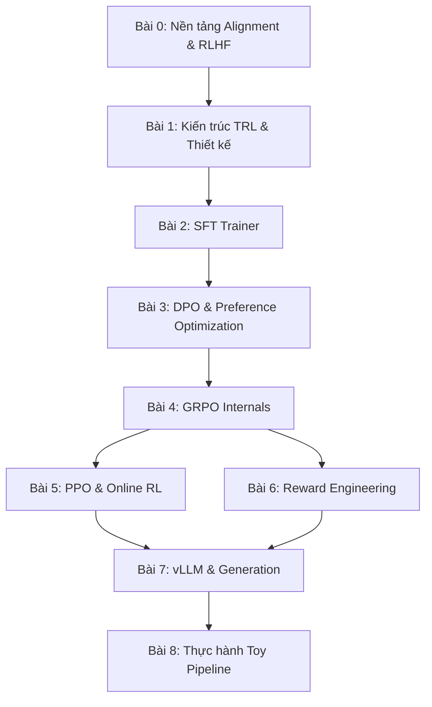

# Lộ trình học tập & Phân tích cấu trúc thư viện TRL

Chào mừng bạn đến với tài liệu phân tích chuyên sâu về kiến trúc và hiện thực của thư viện **TRL** (Transformer Reinforcement Learning) do Hugging Face phát triển và duy trì.

Alignment (căn chỉnh mô hình ngôn ngữ) là bước then chốt biến một LLM pre-trained thành trợ lý AI hữu ích, an toàn và tuân thủ chỉ dẫn. Thư viện `trl` cung cấp bộ công cụ hoàn chỉnh cho toàn bộ pipeline alignment: từ Supervised Fine-Tuning (SFT), Direct Preference Optimization (DPO), đến Group Relative Policy Optimization (GRPO) và nhiều thuật toán tiên tiến khác.

Dưới đây là giáo trình tự học gồm 9 bài đi từ lý thuyết nền tảng đến chi tiết hiện thực và thực hành với `trl`.

---

---

## Tóm tắt Giáo trình 9 Bài học

### 📌 Phần 1: Kiến thức nền tảng & Kiến trúc (Foundation)
* **[Bài 0: Nền tảng Alignment & Toàn cảnh RLHF](lesson_0_alignment_fundamentals)**
  * Tại sao LLM cần Alignment? So sánh SFT, DPO và RLHF.
  * Toàn cảnh hệ sinh thái Hugging Face: Transformers, Accelerate, PEFT, Datasets.
  * Vị trí và vai trò của TRL trong pipeline huấn luyện LLM hiện đại.
* **[Bài 1: Kiến trúc TRL & Triết lý Thiết kế](lesson_1_trl_architecture)**
  * Cấu trúc module: `trl/trainer/`, `trl/models/`, `trl/rewards/`, `trl/generation/`.
  * Cơ chế lazy import, `_BaseTrainer` kế thừa từ HF `Trainer`.
  * Hệ thống Config dataclass (`GRPOConfig`, `DPOConfig`, `SFTConfig`) và cách mở rộng `TrainingArguments`.

### 📌 Phần 2: Các thuật toán Alignment cốt lõi (Core Algorithms)
* **[Bài 2: SFT Trainer - Supervised Fine-Tuning Deep Dive](lesson_2_sft_trainer)**
  * DataCollator cho SFT, kỹ thuật sequence packing và padding strategies.
  * Chat template processing và multimodal support.
  * Phân tích luồng dữ liệu từ dataset đến gradient update.
* **[Bài 3: DPO & Preference Optimization](lesson_3_dpo_preference)**
  * Toán học DPO chi tiết: từ RL objective đến closed-form solution.
  * Các biến thể: CPO, ORPO, IPO, KTO, BCO.
  * Reference model management, `create_reference_model`, PEFT-based reference.

### 📌 Phần 3: Phân tích sâu mã nguồn (Deep Dive Code)
* **[Bài 4: GRPO Internals - Group Relative Policy Optimization](lesson_4_grpo_internals)**
  * Phân tích chi tiết `GRPOTrainer`: rollout, reward computation, advantage calculation.
  * Loss variants: GRPO, DAPO, CISPO, VESPO, SAPO, BNPO, DR-GRPO, LUSPO.
  * Importance sampling correction, off-policy sequence masking, KL penalty variants.
* **[Bài 5: PPO & Online RL - Experimental Trainers](lesson_5_ppo_online_rl)**
  * Kiến trúc `PPOTrainer` trong `trl/experimental/`: value head, GAE computation.
  * Rollout buffer, reward model integration, advantage normalization.
  * So sánh PPO (experimental) vs GRPO (stable).
* **[Bài 6: Reward Engineering & Verification](lesson_6_reward_engineering)**
  * Hệ thống reward functions: `accuracy_reward`, `format_reward`, custom reward.
  * `math_verify` integration, async reward, multi-objective aggregation.
  * Tool-calling reward và environment factory pattern.

### 📌 Phần 4: Tối ưu nâng cao & Thực hành (Optimization & Practice)
* **[Bài 7: vLLM Integration & Generation Optimization](lesson_7_vllm_generation)**
  * `VLLMGeneration` class: colocation mode, tensor parallel size.
  * Importance sampling correction cho training-inference mismatch.
  * Off-policy sequence masking (OPSM) từ DeepSeek-V3.2.
* **[Bài 8: Thực hành - Tự viết Toy Alignment Pipeline](lesson_8_toy_alignment_pipeline)**
  * Tự lập trình một pipeline DPO tối giản bằng PyTorch thuần.
  * Triển khai GRPO loss từ công thức toán học.
  * Mô phỏng các thành phần cốt lõi của TRL trainers.
